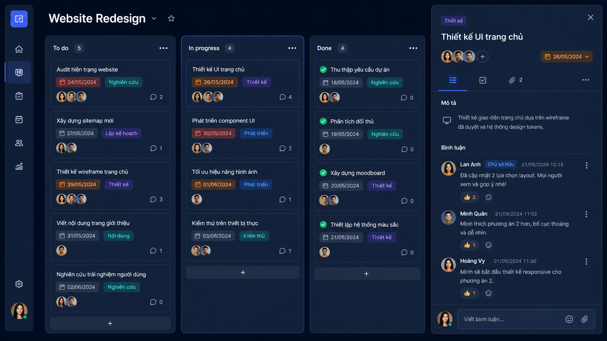
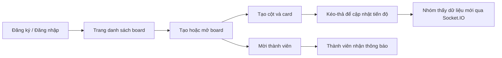
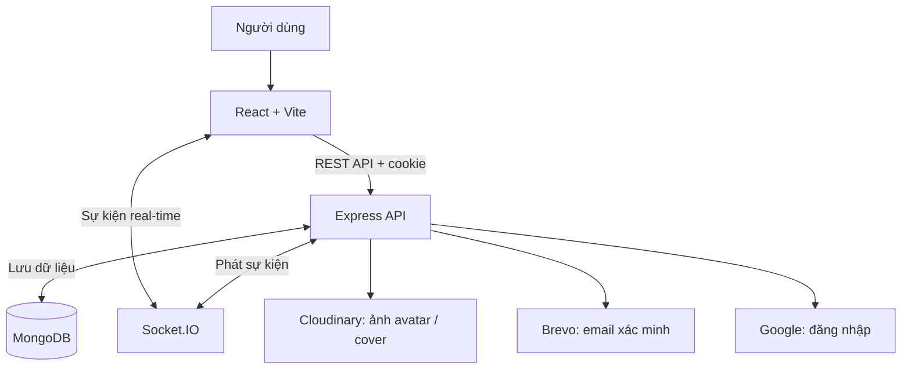

# Trello Pro Web

> Frontend React cho ứng dụng quản lý công việc kiểu Kanban, tập trung vào trải nghiệm kéo-thả, cộng tác và cập nhật thời gian thực.

Đây là ứng dụng SPA độc lập: người dùng đăng nhập, quản lý board/cột/card, mời thành viên và theo dõi công việc trên một giao diện trực quan.

## Dự án này làm gì?

Hãy hình dung một nhóm đang làm website mới. Thay vì giao việc qua tin nhắn rời rạc, nhóm tạo một **board** cho dự án, chia công việc thành các **cột** như “Cần làm”, “Đang thực hiện”, “Hoàn tất”, rồi tạo một **card** cho từng đầu việc.

Mỗi card có thể có người phụ trách, hạn hoàn thành, nhãn ưu tiên, ảnh minh hoạ, mô tả và trao đổi của cả nhóm. Khi một thành viên kéo card sang cột mới hoặc nhận lời mời vào board, những người đang mở ứng dụng được cập nhật gần như ngay lập tức.

> **Mục tiêu:** biến danh sách việc cần làm thành một không gian làm việc chung, rõ tiến độ và dễ phối hợp.

## Hình dung sản phẩm



*Ảnh minh hoạ giao diện được tạo cho tài liệu README, mô phỏng board, cột, card, nhãn, hạn hoàn thành, thành viên và bình luận.*

## Tính năng

- Tạo, tìm kiếm, phân trang, cập nhật và xoá board.
- Tạo, đổi tên, sắp xếp và xoá cột.
- Tạo card và kéo-thả card trong cùng cột hoặc giữa nhiều cột.
- Quản lý card: mô tả Markdown, cover, nhãn màu, hạn hoàn thành, thành viên và bình luận.
- Mời thành viên vào board, nhận và xử lý thông báo lời mời.
- Đăng ký, xác minh email, đăng nhập thường/Google, làm mới phiên đăng nhập.
- Cập nhật tên hiển thị, avatar và mật khẩu; hỗ trợ dark mode.
- Đồng bộ thay đổi board và lời mời bằng Socket.IO.

## Một người dùng sẽ sử dụng như thế nào?



Ví dụ: trưởng nhóm tạo card “Thiết kế trang chủ”, gán cho designer và đặt hạn. Khi designer hoàn thành bản nháp, họ chỉ cần kéo card từ “Đang làm” sang “Hoàn tất”; board của các thành viên khác sẽ được làm mới qua sự kiện real-time.

## Công nghệ

| Nhóm | Công nghệ |
| --- | --- |
| Nền tảng | React 18, Vite, React Router |
| State | Redux Toolkit, Redux Persist |
| UI | Material UI, Emotion, React Toastify |
| Tương tác | dnd-kit, React Hook Form, Markdown Editor |
| Giao tiếp | Axios, Socket.IO Client |

## Cấu trúc mã nguồn

```text
src/
├── pages/          # Auth, boards, board detail, settings, 404
├── components/     # App bar, modal card, form, loading
├── redux/          # User, board, card, notification state
├── apis/           # REST API client
├── socketClient.js # Kết nối thời gian thực
└── utils/          # Axios xác thực, formatter, validator, constants
```

## Chạy local

Yêu cầu Node.js **18+** và backend đang chạy tại `http://localhost:8017`.

```bash
npm install
npm run dev
```

Mở URL do Vite cung cấp (thường là `http://localhost:5173`). Ở development, frontend tự gọi REST API và Socket.IO đến `http://localhost:8017`.

## Build production

```bash
npm run build
npm run preview
```

## Cấu hình runtime

Có thể thay endpoint REST API trong `public/config.js` sau khi build:

```js
window.env = {
  VITE_API_ROOT: 'https://api.example.com',
  VITE_GOOGLE_CLIENT_ID: 'your-google-client-id'
}
```

Socket.IO production được cấu hình riêng trong `src/socketClient.js`; hãy cập nhật URL này khi triển khai backend khác.

## Điểm kỹ thuật đáng chú ý

- Route board/settings được bảo vệ bằng trạng thái người dùng trong Redux.
- Kéo-thả có mouse/touch sensor, placeholder cho cột trống và cập nhật state trước khi gọi API.
- Sau thao tác board, ứng dụng phát Socket.IO event để các client khác tải dữ liệu mới nhất.
- Access token hết hạn được xử lý qua refresh-token flow dựa trên cookie.
- Link có `?cardId=<id>` có thể mở trực tiếp card tương ứng sau khi tải board.

## Frontend giao tiếp với hệ thống ra sao?



Frontend chỉ lưu trạng thái giao diện và thông tin cần thiết cho trải nghiệm người dùng. Dữ liệu nghiệp vụ, xác thực và quyền truy cập được xử lý ở API để tránh đặt thông tin nhạy cảm trên trình duyệt.

## Kiểm tra mã nguồn

```bash
npm run lint
```

`vercel.json` đã có rewrite cho SPA routing và proxy `/api/*` sang backend production.
